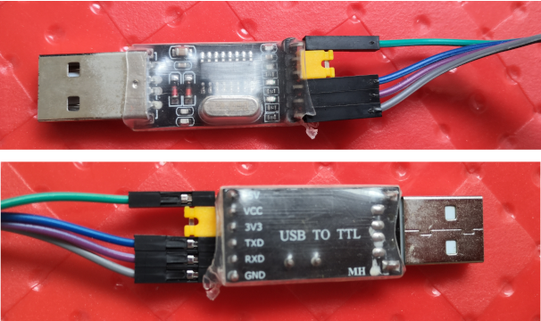

<meta http-equiv="Content-Type" content="text/html; charset=utf-8" />

# 在Linux下玩转STM32

## 1、准备环境

### 1.1 硬件环境

* `STM32F103C6T6`**最小系统**板一块：
    * 为何是`STM32F103C6T6`：因为这大概是某宝上能找到的最便宜的`STM32`最小系统！
    虽然有比它更便宜的裸片型号，但做成最小系统或者开发板之后，价格就变得很吓人！
    焊工不好的人不宜直接焊裸片，钱包不鼓的人买不起贵价板，最佳选择就不言而喻了！
    * 原理图：可自行向卖家索要，此处不展示。
    * 实物图<a id="stm32_img"></a>：

* `USB转TTL`**串口**模块一个（附带杜邦线），可用于：
    * 烧录用户程序。
    * 串口编程。
    * 实物图<a id="usb2ttl_img"></a>：

* `ST-Link`一个（附带杜邦线），可用于：
    * 烧录用户程序。
    * 调试用户程序。
    * 实物图<a id="stlink_img"></a>：

* 其余外设：按个人学习或项目需要自行补充。

### 1.2 软件环境

* 操作系统：`Ubuntu 22.04`。

* **开源**`集成开发环境`（`IDE`）：`STM32CubeIDE`。可点击[此链接](https://www.st.com/en/development-tools/stm32cubeide.html)进行下载。
若页面失效，则可到[ST官网首页](https://www.st.com/)输入`STM32CubeIDE`搜索得到链接后再下载。安装示例：
    ````
    $ unzip en.st-stm32cubeide_1.12.1_16088_20230420_1057_amd64.deb_bundle.sh.zip
    $ sudo sh st-stm32cubeide_1.12.1_16088_20230420_1057_amd64.deb_bundle.sh
    ````

* **开源**`交叉编译器`：`arm-none-eabi-gcc`。安装命令如下：
    ````
    $ sudo apt install gcc-arm-none-eabi
    ````

* **开源**`烧录`工具：`stm32flash`。安装命令如下：
    ````
    $ sudo apt install stm32flash
    ````

* **开源**`调试`工具：`openocd`。安装命令如下：
    ````
    $ sudo apt install openocd
    ````

## 2、热身：烧录一个现成的测试程序（例如卖家提供的配套测试程序）

### 2.1 通过`USB转TTL`串口

* 将`BOOT0`（[STM32实物图](#stm32_img)上面第一排黄色排针）向右接`1`，
`BOOT1`（第二排黄色排针）向左接`0`。

* 将`A9`接`RXD`（见[USB转TTL串口实物图](#usb2ttl_img)）、`A10`接`TXD`，
`GND`和`VCC`也分别接好。

* 测试一下连接是否正常：
    ````
    $ lsmod | grep usbserial
    usbserial              45056  3 ch341
    $
    $ dmesg | grep ttyUSB
    [  890.175796] usb 1-11: ch341-uart converter now attached to ttyUSB0
    $
    $ stm32flash /dev/ttyUSB0
    stm32flash 0.5

    http://stm32flash.sourceforge.net/

    Interface serial_posix: 57600 8E1
    Version      : 0x22
    Option 1     : 0x00
    Option 2     : 0x00
    Device ID    : 0x0412 (STM32F10xxx Low-density)
    - RAM        : Up to 10KiB  (512b reserved by bootloader)
    - Flash      : Up to 32KiB (size first sector: 4x1024)
    - Option RAM : 16b
    - System RAM : 2KiB

    ````

* 烧程序：
    ````
    $ stm32flash -w /path/to/hex_file.hex -v -g 0x0 /dev/ttyUSB0
    stm32flash 0.5

    http://stm32flash.sourceforge.net/

    Using Parser : Intel HEX
    Interface serial_posix: 57600 8E1
    Version      : 0x22
    Option 1     : 0x00
    Option 2     : 0x00
    Device ID    : 0x0412 (STM32F10xxx Low-density)
    - RAM        : Up to 10KiB  (512b reserved by bootloader)
    - Flash      : Up to 32KiB (size first sector: 4x1024)
    - Option RAM : 16b
    - System RAM : 2KiB
    Write to memory
    Erasing memory
    Wrote and verified address 0x08000698 (100.00%) Done.

    Starting execution at address 0x08000000... done.

    ````
    若干注意事项：
    * 以上命令的效果是：
        * 若是`MDK`（`Keil`）生成的`.hex`文件，烧完即可立刻运行，不需改接`BOOT0`和`BOOT1`。
        * 若是`STM32CubeIDE`生成的`.hex`文件，需断电，将`BOOT1`接加`0`，再上电，
        才能运行（很不方便，所以推荐后面的`SWD`烧录），原因待确定。
    * 要进行下一次的烧录：
        * 若是`MDK`（`Keil`）生成的`.hex`文件，必须先进行一次复位（按下核心板的复位键），
        否则会产生`Failed to init device`的错误。
        * 若是`STM32CubeIDE`生成的`.hex`文件，可以直接烧。
    * 若想将核心板恢复正常的启动模式，即从程序闪存（Flash）启动，
    则需将`BOOT0`和`BOOT1`均接`1`。

### 2.2 通过`串行调试`（`SWD`，`Serial Wire Debug`）接口（推荐）

* 将核心板的`BOOT0`（[STM32实物图](#stm32_img)上面第一排黄色排针）、`BOOT1`（第二排黄色排针）均向左接`0`。

* 核心板右端的四条排针从上到下依次是`GND`、`SWCLK`、`SWDIO`、`3.3V`，
将它们一一接上[ST-Link](#stlink_img)即可。

* 烧程序：
    ````
    $ openocd -f /usr/share/openocd/scripts/interface/stlink.cfg \
        -f /usr/share/openocd/scripts/target/stm32f1x.cfg \
        -c init -c "reset halt" -c wait_halt \
        -c "flash write_image erase /path/to/bin_file.bin 0x08000000" \
        -c reset -c shutdown
	Open On-Chip Debugger 0.11.0
	Licensed under GNU GPL v2
	For bug reports, read
		http://openocd.org/doc/doxygen/bugs.html
	Info : auto-selecting first available session transport "hla_swd". To override use 'transport select <transport>'.
	Info : The selected transport took over low-level target control. The results might differ compared to plain JTAG/SWD
	Info : clock speed 1000 kHz
	Info : STLINK V2J39S7 (API v2) VID:PID 0483:3748
	Info : Target voltage: 3.277540
	Info : stm32f1x.cpu: hardware has 6 breakpoints, 4 watchpoints
	Info : starting gdb server for stm32f1x.cpu on 3333
	Info : Listening on port 3333 for gdb connections
	target halted due to debug-request, current mode: Thread
	xPSR: 0x01000000 pc: 0x08000264 msp: 0x20002800
	Info : device id = 0x10006412
	Info : flash size = 32kbytes
	auto erase enabled
	wrote 3072 bytes from file /path/to/bin_file.bin in 0.232478s (12.904 KiB/s)

	shutdown command invoked
    ````

* 若干注意事项：
    * 以上命令的效果是：烧完即可立刻运行，不需改接`BOOT0`和`BOOT1`，
    也不需要手动复位（已通过`-c reset`进行复位）。
    * `-f`选项用于指定`接口配置文件`和`目标芯片配置文件`。若不知道`OpenOCD`的`配置根目录`，
    可执行`whereis openocd`查看。
    * `-c`选项用于指定待执行的命令，可指定多个。若不指定任何命令，则会启动调试服务，
    其中`3333`为`GDB`监听端口、`4444`为`Telnet`监听端口、`6666`为`Tcl`监听端口，
    此时需要另开一个窗口执行`telnet localhost 4444`来进行交互式操作，
    以便进行程序烧录、调试等。
    * `-c "reset halt" -c wait_halt`很重要，若按网上很多文章仅输入`-c halt`，则再次烧录时会报错：
        ````
        Error: timeout waiting for algorithm, a target reset is recommended
        Error: flash write failed at address 0x8000000
        Error: error writing to flash at address 0x08000000 at offset 0x00000000
        ````
    * `-c shutdown`也是必需的，用于退出调试服务（因为只是一次性烧录过程，
    不是持久的调试过程），否则只能按`Ctrl`+`C`来手动退出了。
    * `OpenOCD`是一个很强大的调试器，更详细的用法可查阅其官方用户手册[HTML版](https://openocd.org/doc/html/index.html)
    或[PDF版](http://openocd.org/doc/pdf/openocd.pdf)。若链接失效，
    则可点击[此处](references/openocd.pdf)查看备份文档。

## 3、进入正题：编写一个电子界的`黑佬窝`（`Hello World`）程序<a id="proj_led_blinks"></a>

即**驱动一个LED令其持续闪烁**。步骤如下：

* 打开`STM32CubeIDE`，新建一个名为`led_blinks`的项目，
创建及配置过程在此不再赘述（网上多的是教程，在此提供[其中一个](http://news.eeworld.com.cn/mcu/ic636270.html)），
仅强调重点如下：
    * 将`C13`引脚配置成`输出引脚`（核心板在`C13`引脚接了一个`LED`）。
    * 需要考虑采用`HAL`库还是`LL`库。
    * 需要生成`.hex`和`.bin`文件以用于烧录。
    * 分别以`调试`（`Debug`）模式和`发布`（`Release`）模式编译一次，
    以便生成必要的目录和编译脚本供后面使用。

* 配置完毕并保存之后，会生成相应的代码，可以在此基础上添加自己的业务逻辑，
一般是在`main.c`文件的`main`函数的`while`循环里。对于本例，则有：

    * `while`循环上下文：
        ````
        /* 省略部分内容 */

        /* Initialize all configured peripherals */
        MX_GPIO_Init();
        /* USER CODE BEGIN 2 */

        /* USER CODE END 2 */

        /* Infinite loop */
        /* USER CODE BEGIN WHILE */
        while (1)
        {
            /* <font style="color: red">在此处添加</font><a id="user_code"></a> */
            /* USER CODE END WHILE */

            /* USER CODE BEGIN 3 */
        }
        /* USER CODE END 3 */

        /* 省略部分内容 */
        ````

    * 若是采用`LL`（`Low Layer`，底层）库，则添加：
        ````
        LL_mDelay(1000); /* 延时值可自行决定，单位是毫秒，下同 */
        LL_GPIO_TogglePin(GPIOC, LL_GPIO_PIN_13);
        ````

    * 若是采用`HAL`（`Hardware Abstraction Layer`，硬件抽象层）库，则添加：
        ````
        HAL_Delay(1000);
        HAL_GPIO_TogglePin(GPIOC, GPIO_PIN_13);
        ````

* 编译、烧录、调试/运行，后两者可参考前文。需要注意的是，`STM32CubeIDE`也有调试界面，
但也是基于`OpenOCD`或`GDB`，所以不如一步到位，直接在命令行使用`OpenOCD`或`GDB`，
一次学习，长期受用，不必像忍受IDE界面的频繁变更。

## 4、进阶技巧：打造一个`双全`型项目架构

所谓的`双全`，是指既支持图形化集成开发环境（`IDE`），又支持字符型命令行接口。
开发者可根据自己的偏好，在全流程或部分环节中，既可以选择在IDE下进行编写、编译、调试/运行等操作，
也可以选择使用命令行来完成这些操作。此举既可充分发挥集成开发环境和命令行各自的优势，
也能同时迎合两派开发者的需求，减少两派的纷争。下表简要对比命令行和集成开发环境的特点：

对比项 | 命令行 | 集成开发环境
-- | -- | --
运行速度 | 快，不需过多解释。 | 慢，耗内存，对老旧电脑不友好。
上手速度 | 慢，需要一定基础。 | 快，图形化傻瓜式操作。
接口稳定性 | 非常稳定，因为<br>基础命令万年不变。 | 不稳定，版本升级后，<br>菜单项内容及位置变化较大。
与第三方的集成 | 容易，得益于成熟通用<br>的`Shell`粘合机制。 | 困难，因为各个IDE之间不互通，<br>虽然主流IDE支持插件，<br>但插件的开发仍有一定门槛。
自身的可扩展性 | 脚本透明，容易扩展。 | 源码封闭或庞大，<br>非原始团队难以扩展。
风格的一致性 | 与一般Linux应用项目<br>在形式上较为一致。 | 各有各的风格，难以统一。

下面将以前面的[黑佬窝](#proj_led_blinks)项目为基础，介绍打造这样一个架构所需的重点步骤。

### 4.1 创建用户目录及文件

* 在`STM32CubeIDE`左侧窗格，对着`led_blinks`项目图标右击，依次选择`New`、`Source Folder`，
并在弹出的对话框输入目录名称`User`，最后点击`Finish`按钮，即可创建用户目录。
**此目录用于存放用户代码，不会在每次修改配置、IDE生成代码时覆盖掉**。

* 右击`User`目录，选择`Add/remove include path...`，再在弹出的对话框点击`OK`按钮，
**将此目录加入编译器可搜索的头文件目录列表**，相当于利用`GCC`的`-I`选项指定此目录。

* 右击`User`目录，依次选择`New`、`Header File`，并在弹出的对话框输入头文件名称`biz.h`，
最后点击`Finish`按钮，即可创建头文件，并加入以下内容：
    ````
    #include "stm32f1xx.h"

    void led_blinks(uint32_t interval_ms);
    ````

* 右击`User`目录，依次选择`New`、`Source File`，并在弹出的对话框输入源文件名称`biz.c`，
最后点击`Finish`按钮，即可创建源文件，并加入以下内容：
    ````
    #include "biz.h"

    #ifdef USE_FULL_LL_DRIVER
    #include "stm32f1xx_ll_utils.h"
    #include "stm32f1xx_ll_gpio.h"
    #else
    #include "stm32f1xx_hal.h"
    #include "stm32f1xx_hal_gpio.h"
    #endif

    void led_blinks(uint32_t interval_ms)
    {
    #ifdef USE_FULL_LL_DRIVER
        LL_mDelay(interval_ms);
        LL_GPIO_TogglePin(GPIOC, LL_GPIO_PIN_13);
    #else
        HAL_Delay(interval_ms);
        HAL_GPIO_TogglePin(GPIOC, GPIO_PIN_13);
    #endif
    }
    ````

### 4.2 修改主函数的循环业务逻辑

* 将[前面在`main.c`里添加的内容](#user_code)替换成以下语句即可：
    ````
    led_blinks(1000);
    ````

### 4.3 增加顶层`Makefile`

可以从头编写一个类似普通Linux应用程序的Makefile用于STM32项目中，
但不推荐这样做，原因如下：

* `STM32CubeIDE`的编译也是基于`Makefile`，并且其生成的`Makefile`也可在命令行使用，
再重复造轮子毫无意义。

* 若因为业务配置或IDE的版本更新而导致编译参数变化，此`Makefile`也要同步变更，
徒增工作量，也容易出问题。

所以，推荐的做法应该是，在项目根目录下创建的`Makefile`**以调用各个子目录`Makefile`为主**，
**同时增加一些额外有用的操作**，例如：

* 在不改项目参数的情况下，有选择性地或同时地编译出不同模式的程序。

* 多种烧录方式，比如烧到闪存（Flash）、内存（SRAM）等。

* 生成命令党所用的编辑器的代码浏览配置。

该`Makefile`具体实现详见<a href="https://github.com/FooFooDamon/lazy_coding_skills" target="_blank">懒编程秘笈</a>项目的`makefile/stm32_cube_ide.mk`。
可将其下载下来放到你的STM32项目的根目录，并重命名为`Makefile`，其用法在此不再赘述，
直接查看其内容即可了解，因其非常简单明了。

### 4.4 在该架构下如何协同工作

* 若一个项目由命令党和IDE党共同维护，则在日常的代码编写、编译、烧录、调试/运行等操作中，
两派可各行其是，互不干扰，但需要注意的是，在新增或删除源码目录及文件时，则必须用IDE操作。
若使用命令行操作，则相关的变更不会同步到IDE的配置。

* 该架构暂时只适用于`Unix/Linux`党，因为`Windows`版的`STM32CubeIDE`未测试过，
其生成的`Makefile`里某些编译参数（尤其是路径）可能与前述的脚本不兼容。

