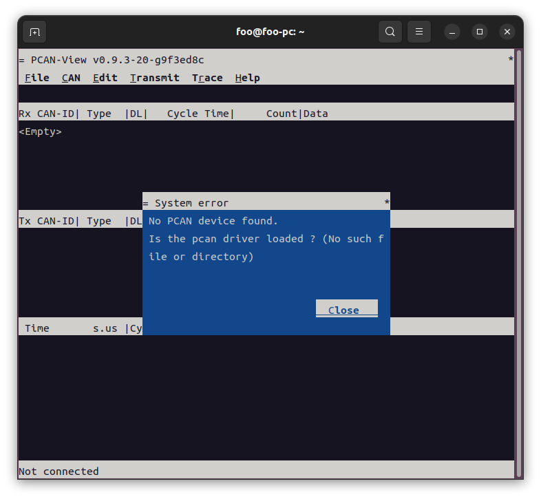

<meta http-equiv="Content-Type" content="text/html; charset=utf-8" />
<base target="_blank" />

# 记一次更换PCAN固件的经历

## 1、需求的催生及演进（若无兴趣可跳过）

* 手头上有个项目分为上、中、下位机，其中下位机负责原始数据的收集和目标设备的控制，
中位机负责业务流程控制和状态监控，上位机负责指令下发和数据可视化。

* 生产环境下的上位机是一台装载`Windows`操作系统和配备业务`上位机程序`的`电脑`，
中位机是一块装载`Linux`操作系统和配备业务`中位机程序`的`ARM`板，
下位机是一块`DSP`板。其中，上、中位机通过`网线`连接，中、下位机则通过`CAN`连接。

* 通过良好的程序设计，`中位机程序`可以同时兼容`X86`（即电脑）和`ARM`两种平台（
通过条件编译）。借助虚拟机，一台电脑可以同时运行`Windows`和`Linux`操作系统。
如果`CAN`接口可以连接电脑，那么开发和测试环境便可将上、中位机的硬件进行合并，
如此便可进行多维/角度、更灵活的测试，为性能优化、程序健壮性增强等提供参考依据。

* 目前在电脑上采用得最广泛的接口是`USB`，尤其对于一些轻薄本，连有线以太网口也砍掉，
但肯定有`USB`口，区别只是`A`型还是`C`型接口而已。所以，`CAN`转`USB`是最自然的想法，
在电脑侧若能直接生成可被`ifconfig`等工具识别并使用的接口就更好，方便命令行操作的同时，
也能基于`SocketCAN`进行编程。

* 一开始的打算是自己做一个，一来想练练手以增加相关的项目经验，
二来因为初期在某宝搜到的产品都较贵（例如某立功）且不确定是否支持`Linux`。
但从头做起难度还是挺大，所以最好有一个现成的产品作为样板（例如可分析其通信数据包）。
于是，一边凑齐零件（主要是蹲守红包、优惠券要花费点时间），一边利用某宝的推送功能，
看能不能捞到`笋嘢`。

* 果不其然，一段时间后，某宝推来的东西不仅实惠小巧，而且有些还支持三大电脑操作系统，
有卖家还以`PCAN`为卖点——我顺手一查发现`PCAN`貌似有点意思，于是便下单买来一探究竟。
然而，由于沟通不到位，最后发来的产品配备的是`SLCAN`而非`PCAN`固件。

* 虽然使用`slcand`命令也能生成网络接口，可满足中位机的使用需求，但由于好奇想见识下`PCAN`，
就问卖家可否在线发`PCAN`固件，以及指导烧录。卖家没有拒绝，但也提出了收费要求
——从商业角度来说这也很合理，不过我想深一层就觉得这钱没必要花，原因有三：
    * `收费的合理性及金额难以评估`：尤其是对方极有可能基于甚至照搬开源项目而做的产品，
    那么软件成本其实无限接近零，仅剩的收费理由就只有烧录方法和固件成品了——换句话说，
    就是赚`信息差`的钱。但是，如果有办法破除信息差，这笔钱就没必要出。
    * `有把握找到解决方案`：并非主观上的盲目自信，而是基于客观的观察及经验。
    按照一贯的套路，但凡国外一开源，国内必然出现“自主创新”。某宝上繁多的产品，
    外观和功能都相近，肯定不是国人潜心做技术而呈现的现象，而是国外同行又开源了，
    所以我至少有九成的把握能找到开源解决方案，到时连固件源码甚至电路图都有了，
    谁还稀罕那一锤子买卖的固件成品？至于烧录方法，极易推断或搜索出来，更不在话下。
    * `潜意识的不满以及挑战心理`：其实在卖家提出收费那一刻就已经有点不爽
    ——并非因为觉得技术不值钱或不想遵守商业规则，而是怀疑对方极有可能免费使用开源成果
    却还要再赚一笔（事后证明确实还有其它卖家免费提供电路图和源码，且商品价格相差无几）。
    而且，越是想隐藏保密的东西，越能勾起别人探索和破解的兴趣，对搞技术的人尤其如此。
    结果固然重要，过程更值得享受。

* 至此，虽然有点啰嗦，但已理由充足师出有名，后面要做的只是顺藤摸瓜见招拆招了。

## 2、需要明确的几个概念

* `CAN`转`USB`：或`USB`转`CAN`、`CAN`-`USB`、`USB`-`CAN`，指的都是同一种东西，
两端的物理接口分别是`CAN`和`USB`。如果简化成一个逻辑框图，硬件层面没多少可说之处，
但软件层面尤其是通信协议却有多种方案，本文着重解释与`CAN`有关的一些容易令人混淆的概念，
详见后面。

* `SocketCAN`：`Linux`特有（`Windows`无，其余类`Unix`未深究有无）、基于`网络栈`（`Network Stack`）、
对应用层提供`套接字`（`Socket`）编程接口（API）的一种`CAN`总线协议**实现**。
有别于以往基于`字符设备`（`chardev`）的实现方案，`SocketCAN`以`网络设备`（`netdev`）的形态出现（
可用`ifconfig`等工具进行查看和设置），在已有代码及机制的复用、驱动通用性及开发难易程度、
模型抽象、多实例访问、应用层编程的一致性等方面均极有优势，
更详细的解释详见[Linux内核文档](https://www.kernel.org/doc/Documentation/networking/can.txt)。

* `CANopen`：是一种基于`CAN`的**高层**通信协议**标准**，其与`CAN`的关系类似于`HTTP`与`TCP/IP`的关系，
更详细的介绍可阅读[NI公司](https://www.ni.com/zh-cn/shop/seamlessly-connect-to-third-party-devices-and-supervisory-system/the-basics-of-canopen.html)
和[CSS Electronics公司](https://www.csselectronics.com/pages/canopen-tutorial-simple-intro#Six%20CORE%20CANopen%20Concepts)
的文章。原本`CANopen`与本文核心的关系不大，在此提及一下，只为了反向过滤，
让大家在搜资料搜产品时不会被误导。

* `CANable`：是不是感觉与上一个`CANopen`很相似？其实不然，`CANopen`是一个**协议标准**，
`CANable`则是国外一个**开源项目**，`一个开源的USB转CAN适配器`（`An Open-Source USB to CAN Adapter`），
其本身分为`硬件`和`软件`两部分。其中，硬件部分虽然有标准版与专业版、1.0与2.0之分，
但由于已定型没什么发挥的空间，所以可以略过不谈，何况官网并没公开硬件设计方案（
但在`GitHub`很容易搜到与它相似的原理图，虽然不是丝毫不差）。
而软件部分的可玩性就高太多了，不仅有多种的固件可供刷入（例如`SLCAN`、`PCAN`等），
还有不同的上位软件可供选择（例如`PCAN-View`、`Cangaroo`、`BUSMASTER`等），
组合起来玩法就多了，堪称百变怪，也是“梦开始的地方”。某宝上之所以冒出那么多USB转CAN产品，
而且能把价格拉下来，与`CANable`不无关系。若想了解更多细节，可访问其[官网](https://canable.io/)，
以及[入门指导](https://canable.io/getting-started.html)（若链接失效，
可点击<a href="references/can2usb/Getting Started - CANable.pdf">此处</a>查看备份文档）。

* `CANtact`：与`CANable`类似而且可能比`CANable`还早，并且根据关联资料的一些蛛丝马迹可推测，
`CANable`似乎正是来源于它（至少是参考过，未深入考究），很多人没注意到这点，
不过这也能解释为什么有个`PCAN`项目（见后面）带`_cantact`后缀了。顺便一猜，
`CANtact`这个名称应该是打了一个`c`**o**`ntact`擦边球。若想了解更多细节，
可访问其：
    * 官网：https://www.linklayer.com/tools
    * 项目硬件：https://github.com/linklayer/cantact-hw.git
    * 项目软件：https://github.com/linklayer/cantact-fw.git

* `candleLight`：也是一个开源项目，与上述两个搭配食用，风味更佳！项目地址：
    * 硬件部分：https://github.com/HubertD/candleLight.git
    * 软件部分：https://github.com/candle-usb/candleLight_fw

* `SLCAN`：即`Serial Line CAN`，**串行**`CAN`，是一种为`串口`与`CAN`牵线、
基于`ASCII`码的文本协议。性能相对较低，协议开销较大，但在`Linux`出现较早、
成熟度较高。其上位软件既可以是`minicom`之类的终端软件用于实时交互，
也可以是`slcand`用于模拟一个可用`ifconfig`等工具进行查看和设置的网络接口（
需要注意的是，此网络接口是`slcand`在它就在、`slcand`亡它就亡）。
同时，`SLCAN`也是`CANable`项目的默认固件。此处提供其中一个固件项目地址：
https://github.com/normaldotcom/canable-fw.git

* `PCAN`：即`PCAN-USB`（狭义）或`PEAK CAN Applications`（广义）的简称，
本文的主角，是一个由`PEAK-System`公司出品的`CAN`总线测试、分析、仿真、
监控的软硬件系统或解决方案，其硬件接口形式（指`CAN`接口的对端）有`USB`、
`PCI`、`ISA`等，产品广泛用于汽车、工业和医疗等行业……
正是一系列的介绍勾起了我的好奇心，想看一看其上位软件是什么样子、如何先进，
才促成了本文的诞生。以下是其官网：
    * 本部官网：https://www.peak-system.com/
    * 中国区官网：https://peak-system.com.cn/

## 3、`PCAN`固件探秘

### 3.1 搜源码（至关重要）

* 使用上一章节的部分概念作为关键词，在`GitHub`、`Google`、`Bing`等网站搜索即可。
思路很简单，麻烦的只是结果筛选，而且结果不止一种，以下直接给出本人所用的。

* 电路图（仅供参考）：
    * 原始项目：即上一章节`candleLight`的`硬件部分`。
    * 个人备份：https://github.com/FooFooDamon/candleLight.git
    * PDF路径：`export/v1.1/pdf/candleLight-v1.1.pdf`
    * 注1：各路卖家做出的实物应该不会与此图完全一样，但主控芯片、`CAN`、
    `USB`之间的连接方式基本固定，没多少发挥空间而且也没必要发挥，所以有此图足矣。
    * 注2：实物图也不放了，用前述的关键词在某宝一搜，找几款**最便宜**、
    **体积最小**且外观相似的一看便知，或者参考前文`CANable`官网里的初代产品图片。

* **源代码**（核心）：
    * 原始项目：https://github.com/moonglow/pcan_cantact.git

### 3.2 推断烧录方式

* 肉眼可见实物并无`SWD`接口，`JTAG`就更不可能（太大），可排除之。

* 有两排`2`脚排针，一排用于`120Ω`电阻，平时扣上跳帽；另一排则用于固件更新（
看商品信息页面或直接咨询卖家可得知），对其真实作用的分析如下：
    * 不像串口：因为市面上的USB转串口（`TTL`）至少`3`条线：收、发、地。
    理论上也有可能是`RS-485`（`2`条差分信号线），但实践中极少如此使用，
    因为不符合接线规范和应用场景，且如此接法只能得到`半双工`串口，
    能否满足烧录的通信要求还不好说。
    * 可能是启动模式引脚：排除了前面一点，就只剩这个可能了。
    至于是`BOOT0`还是`BOOT1`，要结合具体的烧录接口判断，详见后文。

* 转接器对外只有一个`3`针`CAN`口和一个`C`型`USB`口，至此可99.99%确定`USB`就是烧录接口。

* 最后一步，查阅主控芯片`STM32F072`的资料，确认其支持`USB`烧录，
即所谓的`DFU`（`Device Firmware Upgrade`，`设备固件升级`），不仅补齐了最后的0.01%，
还推断出前述未明排针就是`BOOT0`跳线。

* 顺藤摸瓜，查出`DFU`烧录方式既可使用命令行工具`dfu-util`，
也可使用`ST`官方出品的`STM32CubeProgrammer`。本文使用前者。

### 3.3 备份（非常重要）

* “`凡善战者，未谋胜先谋败`”——先将原固件提取出来，就算新固件并不起作用，
也能回复原状。

* 安装烧录工具：
    ```
    $ sudo apt install dfu-util
    ```

* 列举设备信息（要先用跳帽将`BOOT0`接`1`，对此转换器来说就是短接，下同）：
    ```
    $ dfu-util -l
    dfu-util 0.9

    # 省略版权信息输出，下同

    Found DFU: [0483:df11] ver=2200, devnum=13, cfg=1, intf=0, path="1-11.2", alt=1, name="@Option Bytes  /0x1FFFF800/01*016 e", serial="FFFFFFFEFFFF"
    Found DFU: [0483:df11] ver=2200, devnum=13, cfg=1, intf=0, path="1-11.2", alt=0, name="@Internal Flash  /0x08000000/064*0002Kg", serial="FFFFFFFEFFFF"

    ```
    留意上面的**alt**值，因为后面会用到！

* 先不指定长度提取一次：
    ```
    $ dfu-util --alt=0 -s 0x08000000 -U slcan_redundant.bin
    dfu-util 0.9

    Opening DFU capable USB device...
    ID 0483:df11
    Run-time device DFU version 011a
    Claiming USB DFU Interface...
    Setting Alternate Setting #0 ...
    Determining device status: state = dfuIDLE, status = 0
    dfuIDLE, continuing
    DFU mode device DFU version 011a
    Device returned transfer size 2048
    DfuSe interface name: "Internal Flash  "
    Limiting upload to end of memory segment, 131072 bytes
    Upload  [=========================] 100%       131072 bytes
    Upload done.
    ```

* 确定固件的有效长度：
    ```
    $ hexdump slcan_redundant.bin 
    0000000 17ff 2000 20e1 0800 0a55 0800 0a57 0800
    0000010 0000 0000 0000 0000 0000 0000 0000 0000
    0000020 0000 0000 0000 0000 0000 0000 2131 0800
    0000030 0000 0000 0000 0000 2131 0800 0a69 0800
    0000040 2131 0800 2131 0800 2131 0800 2131 0800
    *
    0000080 2131 0800 0000 0000 0000 0000 2131 0800
    0000090 0000 0000 2131 0800 2131 0800 2131 0800
    *
    00000b0 2131 0800 0000 0000 0a75 0800 0a59 0800
    00000c0 b402 4671 0849 0049 5c09 0049 448e bc02
    00000d0 4770 46c0 b403 4671 0849 0040 0049 5e09
    < 省略N行…… >
    0006f50 0000 0000 0000 0000 0000 0000 124c 2000
    0006f60 ffff ffff ffff ffff ffff ffff ffff ffff
    *
    0020000
    ```
    其中：
    * 第一列的（十六进制）值表示某行的起始地址。
    * 星号表示连续重复多次的行。
    * 看到一大片的`ff`行就表示未写入的闪存单元，
    亦即找到了固件的结束位置。就以上内容而言，
    固件的有效长度为：`0x6f60` = `28512`。

* 再指定长度提取一次：
    ```
    $ dfu-util --alt=0 -s 0x08000000:28512 -U slcan.bin
    dfu-util 0.9

    Opening DFU capable USB device...
    ID 0483:df11
    Run-time device DFU version 011a
    Claiming USB DFU Interface...
    Setting Alternate Setting #0 ...
    Determining device status: state = dfuIDLE, status = 0
    dfuIDLE, continuing
    DFU mode device DFU version 011a
    Device returned transfer size 2048
    DfuSe interface name: "Internal Flash  "
    Upload  [=========================] 100%        28512 bytes
    Upload done.
    ```

### 3.4 改源码

* 由于原始的`pcan_cantact`基于`STM32F042`，而转接器的主控芯片是`STM32F072`，
所以需要对比芯片引脚的差异（已确认可以兼容），以及修改源码：
    * 利用`STM32CubeIDE`创建一个`F072`的工程，
    然后将`Core/Startup/startup_stm32f072c8tx.s`和`STM32F072C8TX_FLASH.ld`
    复制到`pcan_cantact`根目录。
    * 打开`Makefile`，将`startup_stm32f042x6.s`改成`startup_stm32f072c8tx.s`，
    `-DSTM32F042x6`改成`-DSTM32F072xB`，`STM32F042C6Tx_FLASH.ld`改成`STM32F072C8TX_FLASH.ld`。
    注意此处只是演示最简单直接的修改，实际上可更进一步使其同时兼容`F042`和`F072`，
    同时增加生成`DFU`格式的固件的逻辑（主要为了消除烧录警告），
    感兴趣可查看本人修改过的项目（在后文）。
    * 最后也是**最关键**的一步：修改`Src/usbd_desc.c`里的`USBD_VID`宏和`cfg_descriptor`变量值。
    之所以要修改，是因为原作者应`PEAK-System`公司的要求，去掉与该公司有关的描述信息及标识符，
    导致编译出来的固件不能被上位驱动识别，详情可查阅该[问题单](https://github.com/moonglow/pcan_cantact/issues/18)。
    若链接失效，可移步下文经本人复刻和修改后的项目，查看备份图片`copyright_issue.png`。
    同样也是出于版权的考虑，本文也不便直接公开`VID`值和描述字符串（修改后的项目也不会改动此文件），
    但前者可在[此网页](http://www.linux-usb.org/usb.ids)查询得到，后者则当你看到源码就知道怎么改，
    并且不改也不影响使用。

* 修改后的项目：https://github.com/FooFooDamon/pcan_cantact.git

### 3.5 编译及烧录（基于修改后的项目）

* 编译：
    ```
    $ make canable MCU_SERIES=F072
    ```

* 烧录二进制固件（不推荐，详见下面烧录过程中的警告）：
    ```
    $ dfu-util --alt=0 -s 0x08000000:leave -D build-canable/pcan_canable_hw.bin 
    dfu-util 0.9

    dfu-util: Invalid DFU suffix signature
    dfu-util: A valid DFU suffix will be required in a future dfu-util release!!!
    Opening DFU capable USB device...
    ID 0483:df11
    Run-time device DFU version 011a
    Claiming USB DFU Interface...
    Setting Alternate Setting #0 ...
    Determining device status: state = dfuIDLE, status = 0
    dfuIDLE, continuing
    DFU mode device DFU version 011a
    Device returned transfer size 2048
    DfuSe interface name: "Internal Flash  "
    Downloading to address = 0x08000000, size = 15260
    Download    [=========================] 100%        15260 bytes
    Download done.
    File downloaded successfully
    Transitioning to dfuMANIFEST state
    ```

* 烧录`DFU`固件（**推荐**）：
    ```
    $ dfu-util --alt=0 -s 0x08000000:leave -D build-canable/pcan_canable_hw.dfu 
    dfu-util 0.9

    Opening DFU capable USB device...
    ID 0483:df11
    Run-time device DFU version 011a
    Claiming USB DFU Interface...
    Setting Alternate Setting #0 ...
    Determining device status: state = dfuIDLE, status = 0
    dfuIDLE, continuing
    DFU mode device DFU version 011a
    Device returned transfer size 2048
    DfuSe interface name: "Internal Flash  "
    Downloading to address = 0x08000000, size = 15260
    Download    [=========================] 100%        15260 bytes
    Download done.
    File downloaded successfully
    Transitioning to dfuMANIFEST state
    ```

* 注意：烧录完毕，要将`BOOT0`的跳帽取下，再重新插拔，转接器才会运行在正常模式。

* 至此，以`PCAN`**固件**为核心的本文本来可以结束，但由于固件并非单独发挥作用、
下位机也需搭配上位机来使用，所以文章仍将继续，各位耐心看多几行或许可以避过一些陷阱。

## 4、懒见愁的（Linux版）上位驱动及应用程序

### 4.1 何为懒见愁

* 这里的“懒”指的是懒人。听过鬼见愁，懒见愁就自然秒懂。

### 4.2 为何懒见愁

* 上位驱动的使用较为复杂——不然卖家也不会发一个免驱的`SLCAN`版本。

* 相对于`Windows`版，`Linux`版上位应用做得很简陋，缺乏一些必要的设置，
以至于重度依赖驱动，而驱动的设置项是全局性的，要变更设置就要重新加载，
麻烦！

* 要摸清驱动和应用的组合用例很繁琐，整理成文也繁琐。

* 以下展示一下有哪些愁。在此之前，先做一些准备工作：
    * 监控系统日志，以便有错误发生时有线索可查：`tail -F /var/log/syslog | grep "usb\|pcan"`
    * 安装上位应用程序`pcanview`及相关的库：
        ```
        $ wget -q http://www.peak-system.com/debian/dists/`lsb_release -cs`/peak-system.list -O- \
            | sudo tee /etc/apt/sources.list.d/peak-system.list
        $ wget -q http://www.peak-system.com/debian/peak-system-public-key.asc -O- \
            | sudo apt-key add -
        $ sudo apt-get update
        $ sudo apt-get install pcanview-ncurses
        $ sudo apt install libpopt-dev
        ```

### 4.3 第一愁：要手动加载驱动

* 可执行`lsmod | grep "peak\|pcan"`来查看驱动的加载情况。
默认情况下没加载驱动，所以没有输出。

* 运行`pcanview`则会提示驱动找不到：

### 4.4 第二愁：`Linux`自带的驱动不支持`pcanview`

* 加载`Linux`自带驱动（应该也是`PEAK-System`公司贡献的）：
    ```
    $ sudo rmmod pcan
    $
    $ sudo modprobe peak_usb
    $
    $ lsmod | grep "peak\|pcan"
    peak_usb               53248  0
    can_dev                45056  1 peak_usb
    ```

* 运行`pcanview`仍然如前图所示，但生成了`can0`（也可能是`can1`、`can2`等，
视系统实际情况而定，本文以`can0`举例）网络接口：
    ```
    $ ifconfig -a
    # 省略前面内容

    can0: flags=128<NOARP>  mtu 16
            unspec 00-00-00-00-00-00-00-00-00-00-00-00-00-00-00-00  txqueuelen 10  (未指定)
            RX packets 0  bytes 0 (0.0 B)
            RX errors 0  dropped 0  overruns 0  frame 0
            TX packets 0  bytes 0 (0.0 B)
            TX errors 0  dropped 0 overruns 0  carrier 0  collisions 0

    # 省略后面内容
    ```

* 在使用该接口之前，需要先设置通信`速率`，否则在激活时会报错：
    ```
    $ sudo ifconfig can0 up
    SIOCSIFFLAGS: 无效的参数
    $
    $ # 或使用ip命令
    $ sudo ip link set can0 up
    RTNETLINK answers: Invalid argument
    ```

* 以上两个命令的报错让人摸不着头脑，但其实系统日志（见前面用于监控系统日志的命令，
下同）已给出答案：
    ```
    peak_usb 1-11:1.0 can0: bit-timing not yet defined
    ```

* 既然如此，就设置一下通信`速率`吧：
    ```
    $ # 速率根据实际的设备而定，这里设为1Mbps
    $ sudo ip link set can0 type can bitrate 1000000
    ```

* 顺便设一下队列长度：
    ```
    $ # 长度也是自行确定
    $ sudo ifconfig can0 txqueuelen 256
    ```

* 最后，再使用前述命令激活`can0`接口即可。之后，便可接上实际设备进行测试了，
又或者直接在本机使用`can-utils`进行简单测试，参考示例如下：
    ```
    $ # 未安装的话，就先安装
    $ sudo apt install can-utils
    $
    $ # 在一个命令行窗口接收
    $ candump -tA can0
    $
    $ # 在另一个命令行窗口发送
    $ cansend can0 '123#1122'
    ```

### 4.5 第三愁：简陋的官方驱动和应用

* 从官网下载[驱动源码包](https://www.peak-system.com/fileadmin/media/linux/files/peak-linux-driver-8.16.0.tar.gz)，
及其[用户手册](https://www.peak-system.com/fileadmin/media/linux/files/PCAN-Driver-Linux_UserMan_eng.pdf)。
若链接失效，则可直接到[官方首页](https://www.peak-system.com/)查找。

* 参考`用户手册`里的说明，安装官方驱动：
    ```
    $ tar -zxvf peak-linux-driver-*.tar.gz && cd peak-linux-driver-*
    $ make clean
    $ # 编译方式1（默认）
    $ make # 或：make chardev
    $ # 编译方式2
    $ # make netdev # 或：make NET=NETDEV_SUPPORT
    $ sudo make install
    ```

* 若使用编译方式1，则用法如下：
    * 打开`/etc/modprobe.d/pcan.conf`并写入以下配置：
        ```
        # 速率自行确定。若不指定该设置项，则速率为默认的500K
        options pcan bitrate=1000000
        ```
    * 加载驱动：
        ```
        $ sudo rmmod peak_usb
        $
        $ sudo modprobe pcan
        $
        $ lsmod | grep "peak\|pcan"
        pcan                  200704  0
        i2c_algo_bit           16384  1 pcan
        $
        $ ls -d /dev/pcan*
        /dev/pcan32  /dev/pcan-usb  /dev/pcanusb32
        $
        $ ifconfig can0
        can0: 获取接口信息时发生错误: Device not found
        ```
    * 正常情况下，`pcanview`启动如下图：
    注意：启动`pcanview`时是可以指定一些选项的，执行`pcanview -h`即可查看支持哪些选项，
    但**只是预留接口，并未实现功能**！可能对`PEAK-System`公司来说，`Linux`用户稀少，
    没什么商业价值，所以就没做吧。

    * 连接成功如下图（注意第三个窗格及底部状态栏的显示）：

    * 接下位机就可以正常接收数据了，如下图（部分信息已作模糊处理）：

    * 若默认或手动指定的速率与实际设备的不匹配，
    则接收不了数据且会提示下线：

    * 现在以`速率`为例，说说传递驱动参数的几种方式：
        * 首先是一种`modprobe`手册（即`man`命令）说了可以传、但实际上可能传不了的方式：
            ```
            $ sudo modprobe pcan bitrate=1000000
            ```
        * 其次是书写比较麻烦、又不能自动处理模块间依赖关系的方式：
            ```
            $ # 实际中不一定位于misc子目录，需自行确定其具体位置
            $ sudo insmod /lib/modules/`uname -r`/misc/pcan.ko bitrate=1000000
            ```
        * 最后一种是保证可行、也是**推荐**的方式：
            ```
            $ # 自带配置的路径为：/etc/modprobe.d/pcan.conf，若不指定配置则使用它。
            $ # 建议创建多几份放在/etc/modprobe.d以外的目录，以应对不同的设备。
            $ sudo modprobe -C /path/to/pcan.conf pcan
            ```

* 若使用编译方式2，则用法如下：
    * 套用编译方式1的`加载驱动`操作。
    * 套用前面的`can0`接口设置速率、队列长度以及激活接口的操作。
    * 注意这种方式纯属没事找事，因为编译出来的驱动能做的事情，系统自带驱动本来就胜任。
    本来期望一个官方驱动能同时支持`CAN`网络接口和`pcanview`的使用，
    但由于这两种应用场合分别对应`网络设备`和`字符设备`驱动，**互斥**，
    不能同时运作，所以**极不推荐**！
    * `互斥`还可以展开讲一下：既表现为在两种编译方式中，
    系统自带驱动与官方驱动同时加载时只能有其中一个正常运行；也表现为在编译方式2之中，
    `CAN`网络接口正常运行之后，再启动`pcanview`，系统日志会报错：
        ```
        pcan: PCAN-USB CAN1 can't be initialized when opened 2 times
        ```
        表现出某种形式的`资源独占`，与字符设备的排它性访问很相似。
        还需要注意的是，这些都是实际测试出来的，可能不同版本有不同表现。
    * 至于未来是否会支持同时使用`CAN`接口和运行`pcanview`，
    可以看看官方论坛七年前的一篇[帖子](https://forum.peak-system.com/viewtopic.php?f=59&t=1963)，
    里面也有用户提到类似的需求，官方的回复则是：
        ```
        Handling both netdev/chardev interfaces at the same time in pcan is not a conceivable option at the moment.
        ```
        没把话说死，貌似从原理上可以实现，只不过有难度，可能还有商业角度的考虑，
        不然不会七年过去还是没有任何改变。

### 4.6 总结

* 若只用到`CAN`网络接口，则没必要安装官方驱动，但使用之前需要进行若干设置。

* `pcanview`与`CAN`网络接口不能同时使用，且两者的驱动都需要手动加载，
即使有办法配置成自动加载也无意义。

* 官方驱动和应用都很简陋，功能没做全就很容易引出一些陷阱和误解，
让我一度怀疑是下位机固件没改好，幸亏还有`Windows`版本的驱动和应用作为对照，
不然真要走不少弯路！

* 若更新了系统内核，则要重新编译及安装`PCAN`驱动。为减少无意义的重复劳动，
可以借助`dkms`来将这些工作自动化，则前面的`make install`需要变更为：
    ```
    $ sudo apt install dkms
    $ sudo make install_with_dkms # 注意要保留好驱动源码目录
    ```

## 5、后续计划

* 调研一下其他上位软件的玩法，以后可能用得着，例如`Cangaroo`、`BUSMASTER`等，
以及它们对应的固件（若有）。因为`PCAN-View`太简陋，
`PCAN-Explorer`又收费且没有`Linux`版，没意思。

* 可能会研究一下如何将`PCAN`驱动的网络设备功能与字符设备功能合并，
或修改`PCAN-View`使其支持参数设置——这两个都很有意思，但也很有难度，
产出时间可谓遥遥无期，但一有产出必会发文，敬请期待。

* 尝试使用`STM32F103`另做一个转换器，估计最大挑战在于如何同时使用
该系列芯片内部`USB`与`CAN`模块共享的`RAM`空间，但似乎已有成功的案例（
为避免打广告的嫌疑，就不举例了，有兴趣者可通过评论区或博客首页的邮件地址询问），
只可惜不开源，不过这样的研究可能更多乐趣。

